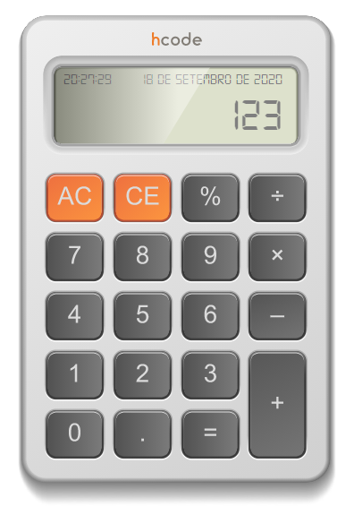

# Vanilla JS Calculator

Projeto desenvolvido em conjunto com o curso da Udemy, da empresa HCode.
Consiste em uma calculadora desenvolvida apenas utilizando o Javascript, sem nenhuma biblioteca.

# Imagem

